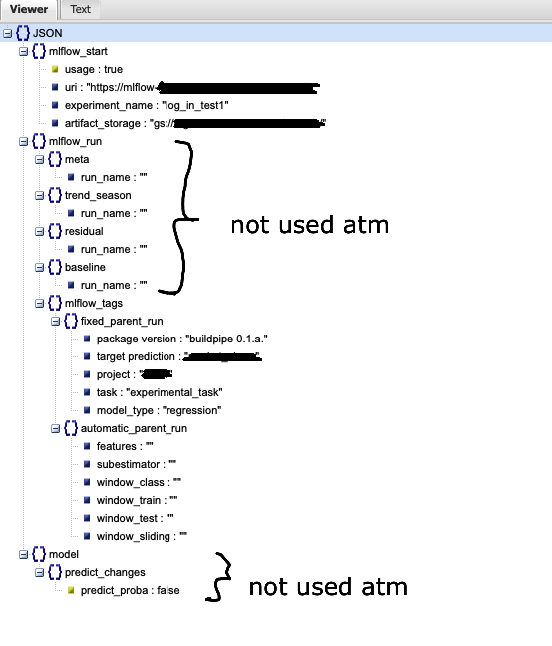

# buildpipe [ 0.5.a ]


## Badges

[](https://www.python.org/downloads/release/python-390/)
[](./reports/junit/report.html)
[](./reports/coverage/coverage.xml)

## Description

The package's main goal is, that you love it. Why?
The package combines several sub pipelines, meta estimators, baselines, several loading methods and mlflow decorators  
into one big meta validation pipeline package. The package also offers some preprocessing and learning techniques
like the famous gaussian seasonality, and comes with a pipe_setup.json file to manage your pipe and mlflow runs.
<br>
<br>
In General, you can compare a regression or classification meta estimators against its partial sub estimators,
thus simple Regressor and/or Classifier Estimators.
Of course, there are also regressor baselines available that predict the outcome in the most simple way.
Make use of a Mlflow Dashboard by using a .env file for your Mlflow user/pw credentials, and the pipe_setup.json to
configure mlflow (keep in mind that this file is also needed if you don't want to use mlflow)
<br>
<br>
What is a Meta Estimator?<br>
Meta Estimators' consist of two combined single estimators in one fit/predict method, for which ou can choose
several time series window techniques (Expanding, Sliding). The pipeline makes all splits/folds, models, hyperparameters and results
comparable and allows you to experiment with many estimators and setups. It is even possible

Note I'm not formally affiliated with the scikit-learn project at all,
but I aim to strictly adhere to their standards, as the authors of sklego also do.


## Installation
Go yo your favorite IDE/Terminal and install `buildpipe` via pip with

```bash
!pip install git+https://github.com/OldPatrick/buildpipe.git
```

<span style="color:red">In case of any trouble, try to clone the repo and install requirements manually"</span>

## Troubleshooting Installation
- it is possible that you have to be added to the project before using the pip installation, if none of the previous
  steps worked please contact a DE or the package owner
- It is possible that your IDE/Jupyter enforces you to upgrade pip. Please use the
upgrade command recommended by your IDE/Jupyter in that case (shown below). Then try to reinstall buildpipe <br> <br>
  - pip install --upgrade pip <br> <br>
- Sometimes several google packages may create issues, when the buildpipe package tries to import them. Use all of the following upgrade commands
to get rid of the missing import issues:
  - pip install --upgrade google-api-python-client
  - pip install --upgrade google-cloud-speech
  - pip install --upgrade google-cloud-bigquery
  - pip install --upgrade google-cloud-storage


## Documentation/Walkthrough
A walkthrough with a parallel documentation can be found in this notebook [here](./walkthrough_buildpipe.ipynb).


## General Usage / Features
The package offers
- Custom combined meta estimators which will be compared against
  - their single usage, and
  - against three baseline estimators (mean, last_obs, rolling_mean).
- You can also decide to reuse time features not only in a trend/seasonal
model, but also again in a residual model, so that your time features may capture all/more aspects of your model,
if your model offers time features like dates or times.
- Fit your MetaEstimator with GridSearchCV, RandomSearchCV or OptunaSearchCV,
  to get the best out of all subspaces, a random selection, or very good guess on your hyperparameters.
- Fit your Partial Estimators with Gridsearch, after you have found the best combination already
- In addition, the package allows you to connect to GCP Datasets and GCP parquet files (latter in the future) in the GCP RTL cloud.
- You can also use some preprocessing features, like
  - adding a linear trend,
  - create a gaussian seasonality for your data (the latter will be self learned by the models in future upgrades).
  - label encode your features and output your encoding
- In addition, you can choose to run pipelines with different cross validation techniques of time series data like:
  - expanding or
  - sliding windows
- Fully integrated logging of key results in MLFlow, if the user wants it
- Usage of several pre-processing steps from sklearn or self-written
- Finally, aligned results to the all models and folds


## Simple Usage Example with GridSearchCV

```python
# a basic meta estimator combined
from buildpipe import Pipe
from buildpipe import Estimator
from buildpipe import ShowResults
from sklearn.decomposition import PCA
from sklearn.preprocessing import StandardScaler
from sklearn.linear_model import LinearRegression
from interpret.glassbox import ExplainableBoostingRegressor

estimator = Estimator(trend_season_model=LinearRegression(),
                      residual_model=ExplainableBoostingRegressor(),
                      time_columns_start=7)

estimator__param = {
  "trend_season": {
    "Estimator__trend_season_model__positive": [True]
  },
  "residual": {
    "Estimator__residual_model__max_leaves": [8, 16, 24, 32],
    "Estimator__residual_model__max_bins": [128, 256]
  }
}

pipe = Pipe(
  data=data,
  target="target_variable_name",
  estimator=estimator,
  params=estimator__param,
  pipe_steps=[("Scaler", StandardScaler()), ("PCA", PCA())],
  window_type="Expanding",
  test_level="276 days",
  date_column="date column name"
)

model, X_train, X_test, y_train, y_test = pipe.fit_pipeline(verbose=5, scoring="r2")
pred = pipe.predict_pipeline(model)
show = ShowResults(model, X_train, X_test, y_train, y_test, time_columns_start=7)
show.show_model_results(pred)

...
```

## Simple Usage Example with OptunaSearchCV

```python
# a basic meta estimator combined
from buildpipe import Pipe
from buildpipe import Estimator
from buildpipe import ShowResults
from sklearn.decomposition import PCA
from sklearn.preprocessing import StandardScaler
from sklearn.linear_model import LinearRegression
from interpret.glassbox import ExplainableBoostingRegressor
#    <new>  
import optuna

#    </new>  

estimator = Estimator(trend_season_model=LinearRegression(),
                      residual_model=ExplainableBoostingRegressor(),
                      time_columns_start=7)

#    <new>  
#    Hint: Optuna makes a search between 128 and 255, while Gridsearch will use 128 or 255 for a search
estimator__param = {
  "trend_season": {
    "MetaEstimator__trend_season_model__positive": optuna.distributions.CategoricalDistribution([False, True])
  },
  "residual": {
    "MetaEstimator__residual_model__max_bins": optuna.distributions.IntUniformDistribution(128, 255)
  }
}
#    </new>  

pipe = Pipe(
  data=data,
  target="target_variable_name",
  estimator=estimator,
  params=estimator__param,
  pipe_steps=[("Scaler", StandardScaler()), ("PCA", PCA())],
  window_type="Expanding",
  test_level="34 W",
  date_column="date column name",
  #    <new>
  search_technique="OptunaSearchCV"
  #    </new>
)

#    <new>  
#    Hint: additional pipeline parameters can be drived from:
#          https://optuna.readthedocs.io/en/stable/reference/generated/optuna.integration.OptunaSearchCV.html
model, X_train, X_test, y_train, y_test = pipe.fit_pipeline(verbose=5, scoring="r2", n_trials=25)
#    </new>  
pred = pipe.predict_pipeline(model)
show = ShowResults(model, X_train, X_test, y_train, y_test, time_columns_start=7)
show.show_model_results(pred)

...
```


<span style="color:red">Please be advised that the current pipe building setup, is based on key postional arguments.
You can <strong>leave</strong> an <strong>unused argument out</strong>, however, you have to <strong>forward every variable to its positional argument.</strong>
That said, you can just build the pipe without pipe_steps by just not writing them. But if you use an argument, always pass it to its respective variable.
This does not account for model results class.</span>


## First usage/loading of Pipe_setup.json
- The first time you import the Pipe class from `buildpipe import Pipe` the pipe_setup.json file will be created in your current working folder.
  Please use it to configure your MlFlow setup.


## Simple Usage of pipe_setup.json


## MLFLow Auth over .env or jupyter magic
The MlFLow Auth will be activated when importing the MlFlow Decorator file namely `buildpipe.MlflowDecorators`.
The buildpipe package will look one level above its current folder for an .env file to find the credentials for MlFlow, as I (the developer and shiny herald of awesomenesment)
am used to have my packages in my project folder. <br><br>
However ,if you use a jupyter instance on Anaconda or GCP, you can override
environment variables, or (if the .env is not found, which may be often the case when using GCP). Although my package will give you a hint, here is again the code:
<strong>Keep in mind that this override has to be made after the import of the MLFlow Decorators and before using the fit method.</strong>

Add:
- %env MLFLOW_TRACKING_USERNAME=username
- %env MLFLOW_TRACKING_PASSWORD=pw
in one of the jupyter cells and execute it.


## Troubleshooting MLFlow
Using the package may create different errors, depending on the environment you are trying to use the buildpipe package
with its ml flow decorators:
- try not to use mlflow with a notebook that resides in project/lab 'xy' in Google but wants to log for a project 'z' in Google.
In other words. For every VM you have an IAM Service Role. Every Service Role is allowed to create artifact storages for MLFlow in Google,
  but only for the project/lab your notebook resides in. Thus, you can not log experiments for project xy over the project y ml flow dashboard.
  Projects have no access to each other, due to account restrictions.

- when using the package without access to GCP, your terminal will throw a warning, that you are not using a Google Auth, however, since you are in the
rtl network, it will still work. This warning vanishes, if you work directly on a jupyter notebook in the GCP


## Feature Classes and Functions
Here's a list of features that this library currently offers:

- `buildpipe.BaselineEstimators.MeanRegressor` predicts the mean of a y_train window
- `buildpipe.BaselineEstimators.LastObsRegressor` predicts the last observation of a y_train window
- `buildpipe.BaselineEstimators.RollingRegressor` predicts the rolling mean of a whole y_train window (flattening spikes in predicction)
- `buildpipe.LoadGCPDataset.GCPDataset` tools to load and look at Google Cloud Datasets over bigquery
- `buildpipe.MetaEstimator.Estimator` combined fit and predict of two estimators
- `buildpipe.ModelBaseline.Baseline` builds the pipelines for the decomposed MetaEstimator and the BaselineEstimators
- `buildpipe.ModelPipe.Pipe` builds the pipeline for the combined MetaEstimator
- `buildpipe.ModelShowResults.ShowResults` offers several metrices and plots for comparing folds and models
- `buildpipe.PreProcessing.Processing` labelencode, list label encoded, gaussian seasonality, add trend
- `buildpipe.SplitMethods.SlidingWindowSplit` SlidingWindowSplitter like the sktime Splitter, borrows from TimeSeriesSplit of sklearn
- `buildpipe.MlflowDecorators` Simple useful functions for Mlflow processes and mlflow decorators to activte mlflow
- `buildpipe.PreTransformers` Functional transformers for Preprocessing data


## Future Features
Here's a list of features that are planned for this library:

- learnable gaussian seasonalities within the pipe (not predetermined)
- learnable trend possibilities (polynomial, etc.)
- local and global importance of features (interpret, shap package)
- Load GCP Parquet files


## Contributing new Features
New Features can be proposed, as same as optimization in code architecture or code writing
New features however, should:
1. contribute toward a representative real-world usecase where they lighten up code work or show other fancyness ;-)
2. any new feature should pass standard unit tests (which will come in a future stable release of buildpipe)
3. if the new feature has been discussed beforehand


## Abandoned Features
- usage of sktime


## Known Bugs
- When using gaussian seasonality it throws an auth warning for MlFLow in GCP, altough there is no connection
made in the respective class

- The mlflow decorator set's up a connection and closes it after each method. If you fit several models in no time (e.g. a few simple baselines) that results in several on/off connection statements for mlflow. that result in
a "Too many connections/max entries exceeded" error of mlflow (Error 100 class). This only occurs if your machine is extremely fast fitting the baselines (mostyl in GCP were you lend hardware power)
  Temporary solution
  <br>
  <br>
The temporary solution to the latter is to wait a little bit before fitting another model (e.g. 30 seconds up to 1 minute)

## Scoring Hints:
https://scikit-learn.org/stable/modules/model_evaluation.html
